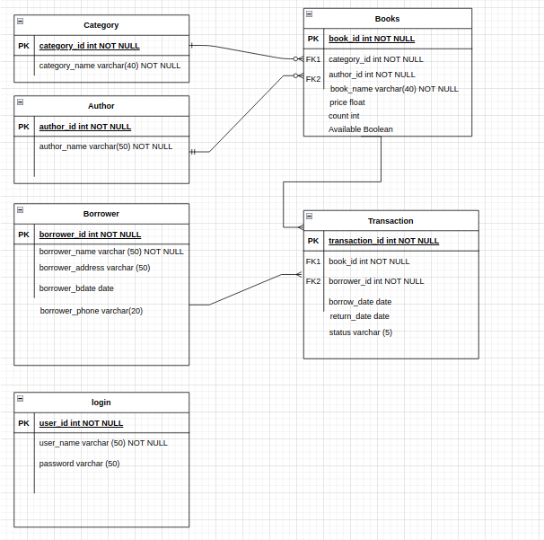

# library-system  
a model for a school library system  
<h2> Resources: </h2> 
Presentation: add link here  
Trello: https://trello.com/b/a3rDk7LC/library-system  
Website:   add url  
github: https://github.com/rabdallah-99/library-system
Risk assessment : add link here  

<h2> Contents </h2>  
1. <a href="#C1">Project Description and Requirements </a>   
   1.1 <a href="#C2"> Additional Requirements  </a> 
   1.2 <a href="#C3"> My Approach  </a>   
2. <a href="#C4"> Architecture </a>  
   2.1 Database Design  
   2.2 CI/CD    
3. Project Management and Version Control  
4. Risk assessment  
5. Testing     report on the success and code coverage of your unit tests.  
6. 

1.<b id=C1> Project Description and Requirements </b> 
    - It was required to create a web application that integrates with a database and demonstrates CRUD functionality. 
    - To host and deploy the application using containers  
    - To create CI/CD pipeline that will test, build and deploy the application.  
    1.1 <b id=C2> Additional Requirements </b>  
        Additional to the above requirements there were some deliverables were requested.  
            - A Trello board & Jira board derived from Trello.  
            - A relational database, consisting of at least two tables that model a relationship.(ERD & Schema)  
            - Documentation of the design phase, application architecture and risk assessment.  
            - A python-based Flask application.  
            - Test suites for the application.  
            - Code hosted into a Version Control System to be built through a CI server and deployed to a cloud-based virtual machine.  
    1.2 <b id=C3> My approach </b>  
           My application is a library system for a school which has a single user (librarian). 
      It has implemented CRUD by giving the ability to ADD, READ, UPDATE, DELETE any of the items that builds the system like books, authors, categories, borrowers... 
      The CI/CD pipeline will be explained later, all the application components are containerised using docker. 
      Unit Testing is applied with every push to the github repository using github webhooks to automate the testing process, build and deploy.  

2. <b id=C4> Architecture </b>  
   2.1 <b id=C5 >Database Design </b>  
         
  

Any future improvements you would make.

You must use diagrams to illustrate your work as much as possible and opt for a succinct writing style. Examples of diagrams to include are:

    Entity Relationship Diagram (ERD).
    A full CI/CD pipeline diagram.
    An infrastructure diagram, illustrating the cloud resources and how they network together.
    A component-level diagram, illustrating how the application interfaces with the database.

