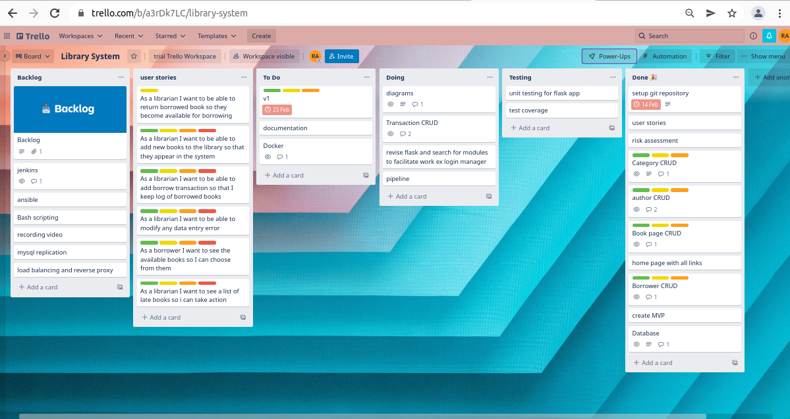
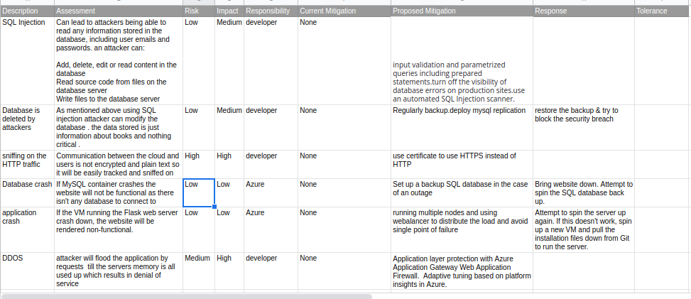

# library-system  
a model for a school library system  
<h2> Resources: </h2> 
Presentation: add link here  
Trello: https://trello.com/b/a3rDk7LC/library-system  
Website:   add url  
github: https://github.com/rabdallah-99/library-system
Risk assessment : https://docs.google.com/spreadsheets/d/1HR6_C_aUr2cwk9Qm1NOSY2wIZ9z--q5OoUCK4qK1BbU/edit#gid=0  

<h2> Contents </h2>  
1. <a href="#C1">Project Description and Requirements </a>   
   1.1 <a href="#C2"> Additional Requirements  </a> 
   1.2 <a href="#C3"> My Approach  </a>   
2. <a href="#C4"> Architecture </a>  
   2.1 <a href="#C5"> Design </a>  
   2.2 <a href="#C6">CD </a>   
3. <a href="#C7"> Management and Version Control </a> 
    3.1 <a href="#B2"> Project Tracking </a>  
    3.2 <a href="=#B1"> Use Cases </a>  
4. <a href="#C8">Risk assessment </a>  
5. Testing     report on the success and code coverage of your unit tests.  
6. 

1.<b id=C1> Project Description and Requirements </b> 
    - It was required to create a web application that integrates with a database and demonstrates CRUD functionality. 
    - To host and deploy the application using containers  
    - To create CI/CD pipeline that will test, build and deploy the application.  
    1.1 <b id=C2> Additional Requirements </b>  
        Additional to the above requirements there were some deliverables were requested.  
            - A Trello board & Jira board derived from Trello.  
            - A relational database, consisting of at least two tables that model a relationship.(ERD & Schema)  
            - Documentation of the design phase, application architecture and risk assessment.  
            - A python-based Flask application.  
            - Test suites for the application.  
            - Code hosted into a Version Control System to be built through a CI server and deployed to a cloud-based virtual machine.  
    1.2 <b id=C3> My approach </b>  
           My application is a library system for a school which has a single user (librarian). 
      It has implemented CRUD by giving the ability to ADD, READ, UPDATE, DELETE any of the items that builds the system like books, authors, categories, borrowers... 
      The CI/CD pipeline will be explained later, all the application components are containerised using docker. 
      Unit Testing is applied with every push to the github repository using github webhooks to automate the testing process, build and deploy.  

2. <b id=C4> Architecture </b>  
   2.1 <b id=C5 >Database Design </b>  
         
  

3. <b id=C7> Management and Version Control </b>  
    3.1 <b id=B2> Project Tracking </b>  
        Trello was used to keep track of what is done and what is still not complete as shown below.  
   
 The board is divided into lists from left to right as the flow of the project :  
Backlog: This list is the start of the project it contained all the items which should be done.  
User stories: This list contained the functionality that is required to be performed which helps in the coding stage.  
To Do : This list contains all items that need to be done but didn't start yet.  
Doing:  This list contains all the open items which are currently under development.  
Testing: This list contains the items which completed its development and waiting for their unit testing.
Done: this list contains all the finished items.  
    3.2 <b id=B1> Use Cases </b>  
   The below use cases were used to create the first MVP for the project  
    - As a librarian I want to be  able to add borrow transaction so that I keep log of borrowed books  
    - As a librarian I want to be able to add new books to the library so that they appear in the system  
    - As a librarian I want to be able to modify any data entry error  
    - As a librarian I want to be able to return borrowed book so they become available for borrowing  
    - As a borrower I want to see the available books so I can choose from them  
    - As a librarian I want to see a list of late books so I can take action  

4. <b id=C8> Risk Assessment </b>  
   The risk assessment is found on https://docs.google.com/spreadsheets/d/1HR6_C_aUr2cwk9Qm1NOSY2wIZ9z--q5OoUCK4qK1BbU/edit#gid=0, a screenshot is found below 

5. <b id=C9 > Testing </b>  
   
    Entity Relationship Diagram (ERD).
    A full CI/CD pipeline diagram.
    An infrastructure diagram, illustrating the cloud resources and how they network together.
    A component-level diagram, illustrating how the application interfaces with the database.

Any future improvements you would make.
